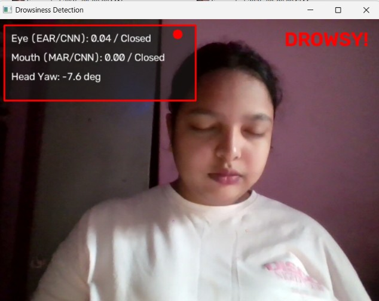
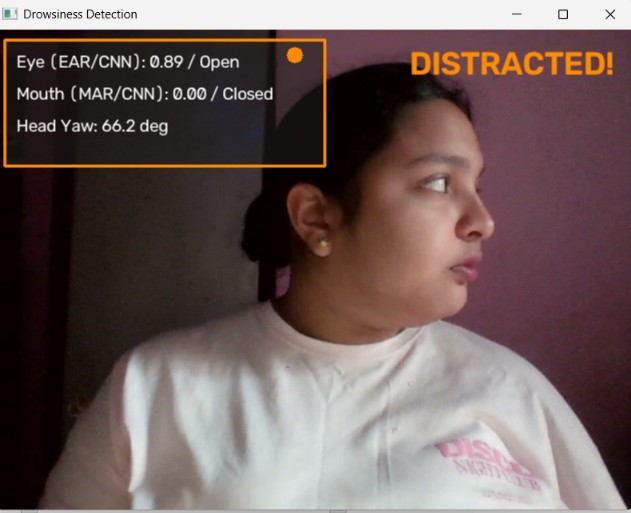

# Driver Drowsiness and Distraction Detection

**Live demo:** https://driver-drowsiness-detection-bdbjcfld2ch7b2ituy8ogw.streamlit.app

## Overview

Driver fatigue and distraction are among the leading causes of road accidents worldwide. Delayed reaction time caused by drowsiness or looking away from the road significantly increases the risk of collisions. Traditional monitoring systems often require expensive hardware, making them unsuitable for low-cost deployment.

This project presents a real-time Driver Drowsiness and Distraction Detection System that combines Deep Learning, Computer Vision, and Facial Landmark Analysis to continuously monitor a driver's eye state, yawning behaviour, and head orientation using a standard webcam.

The project contains two implementations:

- A desktop application built using OpenCV for real-time monitoring.
- A Streamlit web application for browser-based deployment.

---

## Problem Statement

Develop a real-time driver monitoring system capable of detecting:

- Eye closure indicating drowsiness
- Continuous yawning
- Driver distraction caused by looking away from the road

The system should operate using only a webcam without requiring specialized hardware while maintaining real-time performance.

---

## Dataset

The deep learning model was trained using the **Yawn Eye Dataset** available on Kaggle.

Dataset Link:

https://www.kaggle.com/datasets/serenaraju/yawn-eye-dataset-new

Dataset Classes:

- Closed
- Open
- no_yawn
- yawn

Dataset Split used during training:

- Training Images: 1,975
- Validation Images: 492
- Test Images: 433

---

## Project Architecture

```
                    Webcam
                       │
                       ▼
              MediaPipe Face Detection
                       │
        ┌──────────────┼──────────────┐
        ▼              ▼              ▼
      EAR            MAR          Head Pose
        │              │              │
        ▼              ▼              ▼
 Eye Closure      Yawn Detection   Yaw Angle
        │              │              │
        └──────────────┼──────────────┘
                       │
              Alert Decision Logic
                       │
                       ▼
          Driver Status Classification
                       │
                       ▼
            Real-time Visual Alerts
```

---

## Methodology

### 1. Face Landmark Detection

MediaPipe Face Landmarker is used to detect facial landmarks from each video frame.

These landmarks are used to compute:

- Eye Aspect Ratio (EAR)
- Mouth Aspect Ratio (MAR)
- Head Pose Estimation

---

### 2. Eye Aspect Ratio (EAR)

The Eye Aspect Ratio measures the degree of eye openness.

If the EAR remains below a calibrated threshold for multiple consecutive frames, the driver is classified as drowsy.

---

### 3. Mouth Aspect Ratio (MAR)

The Mouth Aspect Ratio measures mouth opening.

A sustained increase in MAR indicates yawning.

---

### 4. Head Pose Estimation

Six facial landmarks are used with OpenCV's SolvePnP algorithm to estimate head orientation.

The computed yaw angle is monitored to determine whether the driver is looking away from the road.

---

### 5. CNN-Based Eye and Yawn Classification

The desktop implementation additionally incorporates a MobileNetV2-based Convolutional Neural Network trained using transfer learning.

The CNN classifies:

- Open Eyes
- Closed Eyes
- Yawning
- Not Yawning

This serves as an additional verification layer alongside facial landmark analysis. Every 10th frame, the CNN's prediction is cross-checked against the EAR/MAR values before an alert is triggered, reducing false positives.

**Example outputs from the desktop application:**


*Driver alert — EAR, MAR, and CNN predictions (Eye: Open, Mouth: no_yawn) all within normal range.*


*Drowsiness detected — CNN confirms Eye: Closed alongside low EAR.*


*Distraction detected — head yaw angle exceeds threshold.*

---

## Model Training

The CNN model was trained using:

- MobileNetV2 (ImageNet pretrained)
- Transfer Learning
- Data Augmentation
- Early Stopping

Training Configuration:

- Image Size: 160 × 160
- Batch Size: 32
- Optimizer: Adam
- Loss Function: Categorical Crossentropy
- Epochs: 20
- Early Stopping Patience: 4

---

## Model Performance

Validation Accuracy

81.71%

Test Accuracy

81.06%

---

## Features

Desktop Application

- Real-time webcam monitoring
- CNN-based eye classification
- CNN-based yawn classification
- EAR computation
- MAR computation
- Head pose estimation
- Audio alerts
- Escalating drowsiness warning
- Visual status panel

Streamlit Web Application

- Browser-based interface
- Webcam monitoring
- Automatic EAR calibration
- Drowsiness detection
- Yawning detection
- Driver distraction detection
- Face-loss detection
- Flashing visual alerts

---

## Technologies Used

- Python
- OpenCV
- MediaPipe
- TensorFlow
- Keras
- MobileNetV2
- NumPy
- Streamlit
- streamlit-webrtc

---

## Repository Structure

```
driver-drowsiness-detection/

│── app.py
│── main.py
│── drowsiness_model.h5
│── face_landmarker.task
│── requirements.txt
│── README.md

│── notebooks/
│     └── Drowsiness_CNN.ipynb

│── screenshots/
│
└── assets/
```

---

## Installation

Clone the repository

```bash
git clone https://github.com/sayamstuti/driver-drowsiness-detection.git
```

Install dependencies

```bash
pip install -r requirements.txt
```

Run the desktop application

```bash
python main.py
```

Run the Streamlit application

```bash
streamlit run app.py
```

---

## Future Improvements

- Temporal deep learning models using LSTM or GRU
- Driver identity verification
- Mobile deployment
- Night-time robustness
- Eye gaze estimation
- Cloud-based monitoring dashboard

---

## Author

Sayam Stuti Shuvadarsini

## Connect with me

-  LinkedIn: www.linkedin.com/in/sayam-stuti-shuvadarsini
-  GitHub: https://github.com/sayamstuti 
-  Email: sayamstuti594@gmail.com 

